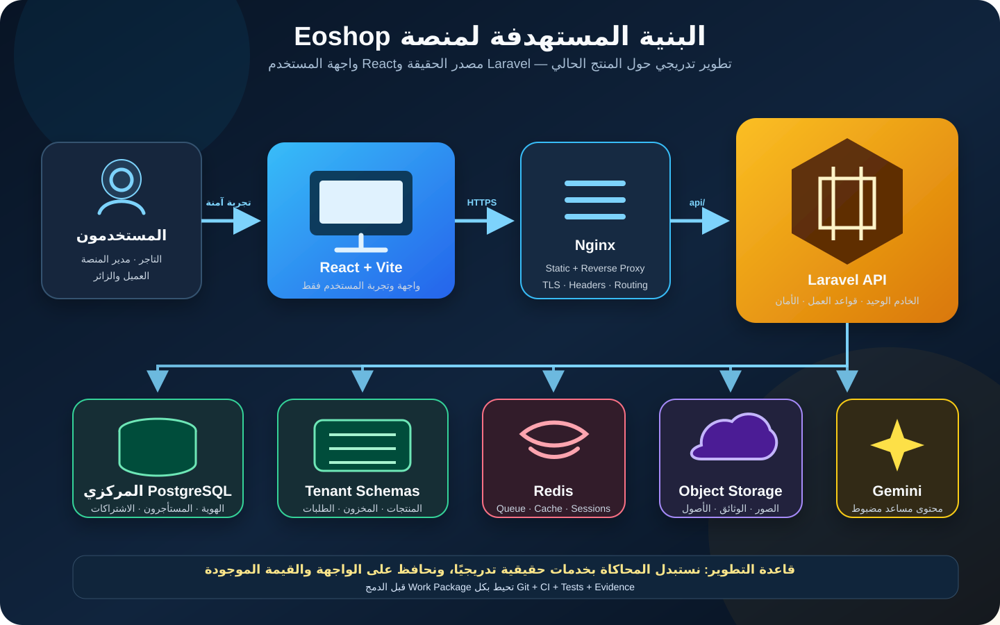

# خطة تثبيت وتطوير البنية المعمارية لمنصة Eoshop

> **نوع الوثيقة:** خطة تنفيذ وضمان هندسي  
> **النهج:** تطوير وإصلاح تدريجي للنظام القائم، وليس إعادة بناء من الصفر  
> **الحالة:** خط أساس مقترح للتنفيذ  
> **النطاق:** منصة Eoshop لإنشاء المتاجر الرقمية الصغيرة، مع أولوية لاحتياجات السوق اليمني

## 1. الملخص التنفيذي

نجحت النسخة الحالية من Eoshop في إخراج فكرة المنتج إلى واقع مرئي قابل للتجربة: يستطيع صاحب المتجر اختيار قالب، توليد هوية ومحتوى أولي بالذكاء الاصطناعي، تخصيص المنتجات، معاينة متجره، والاطلاع على تجربة إدارة وشراء شبه مكتملة.

الهدف في المرحلة القادمة ليس التخلص من هذا العمل أو إعادة كتابة المشروع بالكامل، بل **الحفاظ على الواجهة والفكرة الحالية وتثبيت عمود فقري هندسي حقيقي حولهما**. سنستبدل الوظائف المحاكية بوظائف خادمية موثوقة تدريجيًا، مع المحافظة على تجربة المستخدم الحالية ومنع التوقف الطويل أو الانحراف إلى إعادة بناء غير ضرورية.

تعتمد الخطة المنهجية التالية:

```text
Phase
└─ Work Package
   ├─ Implementation
   ├─ Gates
   ├─ Evidence
   └─ Commit / PR / CI / Merge
```

وتُستخدم T0–T5 كطبقة تنظيم وضمان تتكرر داخل كل Work Package، ولا تُعامل كمرحلة أو Work Package مستقلة.

## 2. رؤية المنتج

تهدف Eoshop إلى تمكين أصحاب المتاجر الصغيرة، خصوصًا في اليمن والأسواق التي ما زالت فيها ثقافة المتاجر الرقمية محدودة، من الانتقال إلى التجارة الإلكترونية دون تعقيد المنصات العملاقة.

تتركز قيمة المنتج في:

- إنشاء متجر رقمي بسرعة وبخطوات مفهومة.
- قوالب عربية قابلة للتخصيص دون خبرة تقنية.
- مساعدة الذكاء الاصطناعي في الهوية والمحتوى والمنتجات.
- دعم طرق الدفع والتشغيل المناسبة للسوق المحلي.
- تحويل البيع عبر صفحات التواصل الاجتماعي إلى تجارة منظمة قابلة للقياس.
- تمهيد الطريق لربط المنتج بإعلانه أو منشوره على شبكات التواصل الاجتماعي.

## 3. المبادئ الحاكمة

1. **لا إعادة بناء شاملة الآن:** أي تغيير يجب أن يحافظ على القيمة الموجودة ويستبدل المحاكاة تدريجيًا.
2. **Laravel مصدر الحقيقة:** جميع عمليات الهوية والمتاجر والمنتجات والطلبات والصلاحيات تتم على الخادم.
3. **React واجهة وليست قاعدة بيانات:** لا تُحفظ بيانات الأعمال الأساسية في `localStorage`.
4. **الأمان على الخادم:** إخفاء الزر أو الصفحة في الواجهة لا يُعد حماية.
5. **التغيير الصغير القابل للإثبات:** كل Work Package صغير، محدد، قابل للاختبار والتراجع.
6. **التوافق قبل التفكيك:** نستخدم طبقات توافق وواجهات API قبل إعادة تنظيم المكونات الكبيرة.
7. **لا دمج دون دليل:** نجاح CI والاختبارات والأدلة التشغيلية شرط للدمج.
8. **التوسع يأتي بعد صحة العمليات:** لا تحسين أداء نظام لا تزال عملياته الأساسية غير موثوقة.

## 4. البنية المستهدفة



### 4.1 القرارات المعمارية الأساسية

- **React + Vite:** واجهة المستخدم ولوحات التاجر والإدارة والمتجر العام.
- **Nginx:** تقديم ملفات الواجهة وتمرير طلبات API إلى Laravel.
- **Laravel API:** الخادم الوحيد ومنفذ قواعد العمل والمصادقة والصلاحيات.
- **PostgreSQL المركزي:** المستخدمون، المستأجرون، النطاقات، الباقات، الاشتراكات وسجل الإدارة.
- **Tenant Schema:** بيانات كل متجر التشغيلية في Schema مستقل خلال مرحلة MVP.
- **Redis:** الصفوف والكاش والجلسات والمهام غير المتزامنة عند تفعيل التشغيل المتقدم.
- **Object Storage:** صور المنتجات والوثائق والأصول القابلة للرفع بدل التخزين المحلي الدائم.
- **Gemini:** خدمة مساندة خلف Laravel مع حدود استخدام ومراقبة وتسجيل أخطاء.
- **Node.js:** أداة بناء للواجهة فقط، وليس خادم أعمال موازيًا لـLaravel.

## 5. خارطة التنفيذ

## Phase 0 — خط الأساس والحوكمة والتشغيل الموحد

### WP 0.1 — Baseline آمن وقابل للرجوع

#### Implementation

- إدخال المشروع كاملًا تحت Git مع الحفاظ على حالته الحالية.
- إعداد `.gitignore` لاستبعاد الأسرار والاعتمادات والملفات المولدة والجلسات والكاش.
- فحص الملفات الحساسة قبل أول Commit.
- إنشاء Baseline Commit ووسم واضح للحالة السابقة للإصلاحات.
- إنشاء `README` يصف التشغيل الحالي والقيود المعروفة.

#### Gates

- لا يوجد `.env` أو مفتاح أو كلمة مرور حقيقية في Git.
- لا توجد ملفات `vendor` أو `node_modules` أو جلسات تشغيل ضمن المستودع.
- يمكن الرجوع للحالة الأصلية بوضوح.
- لا يوجد تغيير وظيفي غير مقصود في الواجهة.

#### Evidence

- نتيجة فحص الأسرار.
- قائمة الملفات المتتبعة والمستبعدة.
- Git status نظيف.
- معرف Baseline Commit أو Tag.

### WP 0.2 — تثبيت معمارية خادم واحدة

#### Implementation

- اعتماد Laravel كخادم API وحيد في ADR رسمي.
- نقل/توحيد استدعاء Gemini خلف Laravel.
- إلغاء اعتماد الإنتاج على Express في `server.ts`.
- إبقاء Node لأوامر Vite والبناء والاختبارات فقط.
- تثبيت نسخ PHP وLaravel وComposer وصور Docker.
- توحيد سلوك `/api` بين التطوير والاختبار والإنتاج.

#### Gates

- لا توجد وظيفتان خادميتان تنفذان العملية نفسها.
- استدعاء API نفسه يعطي السلوك نفسه في جميع البيئات.
- البناء يبدأ من نسخة نظيفة دون اعتماد على ملفات محلية غير موثقة.

#### Evidence

- ADR المعمارية.
- قائمة المسارات بعد التوحيد.
- سجل تشغيل وبناء من بيئة نظيفة.

### WP 0.3 — بوابة الجودة وCI الأولية

#### Implementation

- فحص TypeScript دون إصدار ملفات.
- تنسيق وتحليل ساكن لكود PHP.
- اختبارات Laravel وReact الأساسية.
- فحص اعتمادات Composer وNPM.
- التحقق من Docker Compose والمهاجرات.
- إنشاء CI ينفذ البوابات نفسها لكل Pull Request.

#### Gate

لا يُدمج أي تغيير بعد هذه الحزمة إذا لم تكن جميع فحوص CI ناجحة.

## Phase 1 — الهوية والمصادقة والصلاحيات

### WP 1.1 — نموذج الهوية المركزي

#### Implementation

- إنشاء `users` و`roles` و`permissions` و`tenant_user`.
- تعريف أدوار Platform Super Admin وPlatform Reviewer وMerchant Owner وMerchant Staff.
- تصميم علاقة المستخدم بأكثر من متجر مستقبلًا دون فرضها على تجربة MVP.
- إنشاء سجل `admin_audit_logs` للعمليات الحساسة.

### WP 1.2 — مصادقة التاجر

#### Implementation

- تسجيل مستخدم حقيقي وتشفير كلمة المرور.
- تسجيل الدخول والخروج واستعادة كلمة المرور.
- جلسة آمنة للوحة المركزية باستخدام الآلية المعتمدة في Laravel.
- دمج حالتي `authUser` و`registeredUser` في مصدر هوية واحد.
- إزالة تسجيل الدخول الاجتماعي الوهمي حتى يُنفذ تكامل حقيقي.

### WP 1.3 — حماية إدارة المنصة

#### Implementation

- إزالة قبول بيانات الإدارة الوهمية.
- حماية جميع مسارات الإدارة بالمصادقة والصلاحيات.
- تطبيق Policies على القبول والرفض والتعليق والتعديل والحذف.
- تسجيل الفاعل والزمن والقيمة السابقة والجديدة في Audit Log.

#### Gates للمرحلة

- المستخدم غير المسجل يحصل على `401`.
- المستخدم المسجل دون صلاحية يحصل على `403`.
- لا يمكن منح صلاحية Admin من المتصفح.
- اختبارات الحالات السلبية للصلاحيات ناجحة.

## Phase 2 — دورة حياة المستأجر والمتجر والنطاق

### WP 2.1 — إصلاح Tenancy والترحيلات

#### Implementation

- تسجيل مسارات المستأجر وTenancy Service Provider فعليًا.
- اعتماد صيغة موحدة للنطاق المخزن والمستخدم في التعرف على المستأجر.
- تطبيع النطاق قبل التحقق من uniqueness.
- توصيل migrations المركزية ومهاجرات المستأجرين بأوامر واضحة.
- توثيق قرار Schema-per-tenant وحدوده وخطة مراقبته.

### WP 2.2 — Provisioning احترافي وقابل للاستعادة

#### Implementation

- فصل تقديم طلب المتجر عن تهيئة Schema.
- إنشاء Job غير متزامن للتهيئة والمهاجرات والإعداد الأولي.
- جعل العملية Idempotent وقابلة لإعادة المحاولة.
- تسجيل خطوات التهيئة وأسباب الفشل.
- تنفيذ تعويض أو تنظيف آمن عند فشل خطوة بعد إنشاء السجل المركزي.

#### حالات دورة الحياة

```text
draft → submitted → approved → provisioning → active
                    ↘ rejected
active → suspended
provisioning → failed → retrying
```

### WP 2.3 — النطاق والباقات

#### Implementation

- تحقق حقيقي من توفر النطاق.
- حجز ذري للنطاق يمنع السباق والتكرار.
- ربط الباقة والاشتراك بالمستأجر.
- فصل "طلب النشر" عن "المتجر نشط".
- عدم عرض نجاح للمستخدم قبل اكتمال العملية الفعلية.

#### Gate للمرحلة

اختبار End-to-End ينشئ متجرًا، ينفذ migrations، يحفظ الإعدادات، ثم يصل إلى المتجر عبر النطاق الصحيح، مع اختبار الفشل وإعادة المحاولة.

## Phase 3 — توصيل الواجهة بالخلفية

### WP 3.1 — طبقة API موحدة

#### Implementation

- API client مركزي بعقود وTypes واضحة.
- معالجة موحدة لحالات `401` و`403` و`422` و`429` و`500`.
- حالات Loading وError وRetry قابلة لإعادة الاستخدام.
- اعتماد DTOs تمنع انتقال شكل قاعدة البيانات مباشرة إلى الواجهة.

### WP 3.2 — استبدال تخزين المتصفح تدريجيًا

#### ترتيب النقل

1. المستخدم والجلسة.
2. بيانات المتجر.
3. إعدادات التصميم.
4. المنتجات والمخزون.
5. لوحة الإدارة.
6. حالة النطاق والاشتراك.

يُسمح باستخدام `localStorage` فقط للمسودات غير المنشورة والتفضيلات غير الحساسة.

### WP 3.3 — الحفاظ على الواجهة الحالية

#### Implementation

- وضع Adapters بين المكونات الحالية وAPI.
- منع إعادة تصميم الشاشات أثناء تحويل العمليات.
- استخدام Feature Flags عند الحاجة لطرح الوظائف تدريجيًا.
- مقارنة السلوك قبل التغيير وبعده باختبارات واجهة أساسية.

#### Gate للمرحلة

فتح الحساب أو المتجر من جهاز آخر يعرض البيانات نفسها، ولوحة الإدارة ترى جميع المتاجر الفعلية بحسب الصلاحيات.

## Phase 4 — نواة التجارة والطلبات

### WP 4.1 — المنتجات والأسعار

#### Implementation

- نموذج منتجات دائم مع SKU وحالة نشر وتصنيف.
- سعر أساسي وسعر عرض وعملة محددة للمتجر.
- دعم الصور من تخزين مخصص.
- تجهيز النموذج لإضافة Variants لاحقًا دون تعقيد MVP.

### WP 4.2 — المخزون

#### Implementation

- إنشاء سجل `inventory_movements` للإضافة والخصم والحجز والإرجاع والتسوية.
- حماية العمليات المتزامنة.
- منع الكميات السالبة.
- تسجيل سبب كل حركة والجهة المنفذة.

### WP 4.3 — الطلبات

#### النموذج المقترح

- `orders`
- `order_items`
- `order_addresses`
- `order_status_history`
- `payment_attempts`
- `inventory_movements`

#### قواعد إلزامية

- يعيد الخادم حساب السعر والخصم والشحن والرسوم والإجمالي.
- لا يثق الخادم في `totalAmount` القادم من المتصفح.
- يخزن الطلب Snapshot لاسم المنتج وسعره وقت الشراء.
- تُحمى عملية الإنشاء بمفتاح Idempotency.
- تُدار انتقالات حالة الطلب بقواعد واضحة وسجل تاريخي.

### WP 4.4 — احتياجات السوق المحلي

#### الأولويات

- الدفع عند الاستلام.
- التحويل البنكي.
- المحافظ المحلية.
- رفع إثبات التحويل.
- إشعارات واتساب دون جعله مخزن الطلب الأساسي.
- بوابات الدفع الإلكتروني في Work Package لاحقة.

#### Gates للمرحلة

- تغيير السعر في المتصفح لا يغير قيمة الطلب.
- تكرار الطلب لا ينشئ طلبين.
- طلبان متزامنان لا يبيعان مخزونًا غير متاح.
- جميع انتقالات الحالة قابلة للتدقيق.

## Phase 5 — التفكيك المنظم للواجهة

لا يتم تنفيذ Refactor شامل. القاعدة هي: **كل ملف يُلمس لإضافة وظيفة حقيقية، يُفصل منه الجزء المرتبط بتلك الوظيفة ضمن نفس النطاق فقط.**

### الهيكل المتوقع

```text
src/
├─ app/
├─ features/
│  ├─ auth/
│  ├─ store-builder/
│  ├─ catalog/
│  ├─ inventory/
│  ├─ checkout/
│  ├─ tenancy/
│  └─ platform-admin/
├─ components/
├─ api/
├─ hooks/
├─ schemas/
└─ types/
```

### النتائج المستهدفة

- يتحول `App.tsx` إلى تركيب Routes وProviders وحالات عامة قليلة.
- ينقسم `ControlPanel` حسب وحدات التخصيص.
- ينقسم `StorePreview` إلى صفحات ومكونات متجر مستقلة.
- تنتقل قواعد العمل من المكونات إلى Services/Hooks وخلفية Laravel بحسب مسؤوليتها.
- تُضاف الاختبارات أثناء الفصل، وليس بعد انتهائه.

## Phase 6 — التشغيل والأداء والتوسع

### Work Packages المتوقعة

- Redis للكاش والصفوف والجلسات.
- Queue workers مستقلة للتهيئة والذكاء الاصطناعي والإشعارات والصور.
- Object Storage وCDN.
- استخدام PgBouncer فعليًا أو إزالته حتى الحاجة إليه.
- Healthchecks وstructured logs وcorrelation IDs.
- Metrics وتنبيهات تشغيلية.
- Rate limits حسب المسار والمستخدم والمستأجر.
- نسخ احتياطية واستعادة مجربة.
- حدود موارد واستخدام حسب الباقة.
- اختبارات تحميل بأهداف يتم الاتفاق عليها من بيانات الاستخدام الحقيقية.

## 6. الربط المستقبلي بالإعلانات الاجتماعية

يُنفذ الربط كـBounded Context مستقل بعد استقرار المنتجات والطلبات، وليس كمنطق متناثر داخل مكونات المتجر.

```text
Product
└─ Social Listing
   ├─ Platform
   ├─ Post / Ad URL
   ├─ Campaign Metadata
   ├─ Tracking Code
   ├─ Landing Link
   └─ Attribution / Orders
```

### التسلسل المقترح

1. رابط صفحة منتج صالح وسريع للمشاركة.
2. رابط متتبع لكل إعلان أو منشور.
3. توليد نص الإعلان والصورة المقترحة بالذكاء الاصطناعي.
4. نشر يدوي منظم في المرحلة الأولى.
5. قياس الزيارات والطلبات المنسوبة للرابط.
6. تكامل مباشر مع APIs المنصات التي تسمح بذلك في مراحل لاحقة.

## 7. طبقة الضمان T0–T5

تُطبق الطبقة التالية داخل كل Work Package:

| المستوى | الغرض | المخرجات المطلوبة |
|---|---|---|
| T0 — Scope & Baseline | تحديد النطاق والحالة الحالية ومعايير القبول | Baseline، مخاطر، نطاق، Acceptance Criteria |
| T1 — Design | تصميم التغيير قبل تنفيذه | ADR أو تصميم مختصر، عقود، بيانات، Threat Model، Rollback Plan |
| T2 — Implementation | تنفيذ أصغر تغيير مكتمل | كود محدود النطاق، توافق أو Feature Flag عند الحاجة |
| T3 — Verification | إثبات صحة الوظيفة | Unit، Integration، Feature، Negative Tests |
| T4 — Operational Gate | التحقق التشغيلي والأمني | Security، migrations، rollback، performance، observability |
| T5 — Release Evidence | تجهيز الدمج والإصدار | Evidence، توثيق، CI ناجح، PR ومراجعة |

## 8. عقد Work Package

لا تبدأ أي حزمة دون:

- هدف واضح ومحدود.
- ما يدخل وما لا يدخل في النطاق.
- معايير قبول قابلة للاختبار.
- تبعيات ومخاطر معروفة.
- خطة تراجع أو تعويض عند وجود تغيير بيانات.

ولا تُغلق دون:

- نجاح Gates المتفق عليها.
- Evidence محفوظ داخل PR أو تقارير CI.
- تحديث التوثيق المتأثر.
- Commit أو Commits ذات غرض واحد.
- مراجعة واعتماد قبل الدمج.

## 9. سياسة Commit / PR / CI / Merge

- فرع مستقل لكل Work Package أو جزء قابل للتسليم منها.
- لا تُخلط إصلاحات الأمن مع إعادة تنسيق واسعة.
- Commits صغيرة برسائل تشرح النتيجة وليس مجرد أسماء الملفات.
- PR يحتوي: السبب، التغيير، المخاطر، الاختبارات، الأدلة وخطة التراجع.
- يمنع الدمج المباشر عند فشل CI أو غياب مراجعة التغييرات الحساسة.
- migrations يجب أن تكون قابلة للتجربة على نسخة نظيفة وعلى بيانات قائمة.
- أي تغيير في API يرفق بعقد محدث واختبار توافق.

## 10. ترتيب التنفيذ الإلزامي

1. WP 0.1 — Baseline وGit.
2. WP 0.2 — Laravel خادم وحيد.
3. WP 0.3 — CI وبوابات الجودة.
4. Phase 1 — الهوية والصلاحيات.
5. Phase 2 — Tenancy ودورة حياة المتجر.
6. Phase 3 — ربط الواجهة بالخادم.
7. Phase 4 — الطلبات والتسعير والمخزون.
8. Phase 5 — التفكيك التدريجي أثناء العمل.
9. Phase 6 — الأداء والتوسع والتشغيل المتقدم.
10. الربط الاجتماعي بعد استقرار المنتج والطلبات وقابلية التتبع.

## 11. تعريف النجاح

تنجح هذه الخطة عندما يتحول المشروع تدريجيًا من نموذج يعمل داخل متصفح واحد إلى منتج يمكن الوثوق به، دون خسارة تجربة المستخدم الحالية أو إيقاف التطوير لفترة طويلة.

النجاح لا يعني كثرة الملفات أو الخدمات؛ بل يعني:

- هوية وصلاحيات لا يمكن تجاوزها من المتصفح.
- متجر يتم إنشاؤه وتشغيله واستعادته بطريقة قابلة للتدقيق.
- بيانات تظهر للمستخدم نفسه من أي جهاز مصرح له.
- طلب لا يمكن التلاعب بسعره أو مخزونه.
- تغييرات صغيرة تمر عبر Gates وEvidence وCI.
- قابلية تطوير المنتج لاحقًا للربط الاجتماعي والدفع والتوسع دون إعادة هدم الأساس.

